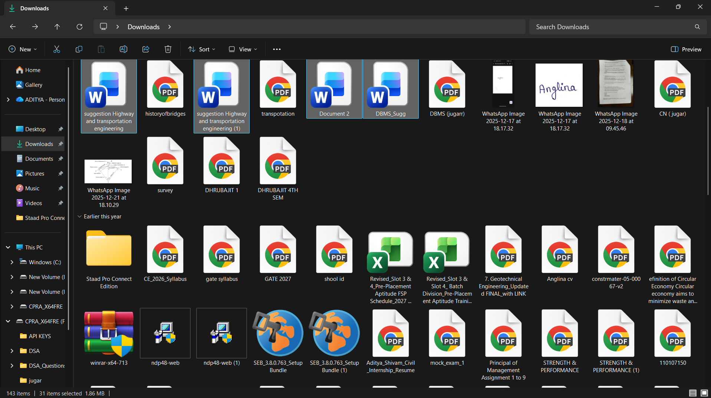
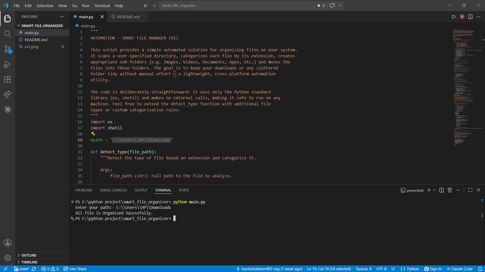
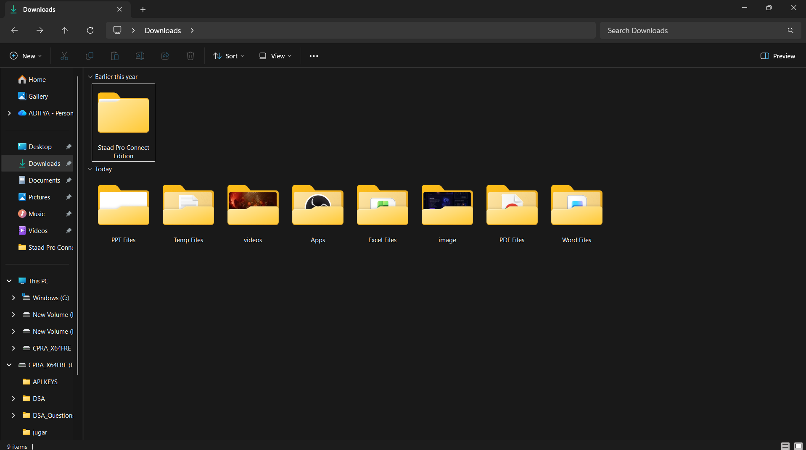

# SMART FILE ORGANIZER (V1)

## Overview

**SMART FILE ORGANIZER** is a lightweight, cross‑platform Python utility that automatically organizes the contents of a folder. It scans a user‑specified directory, categorises each file based on its extension, creates appropriately named sub‑folders (e.g., `image`, `videos`, `Word Files`, `PDF Files`, `PPT Files`, `Excel Files`, `Apps`, `Temp Files`), and moves the files into those folders.

The script is intentionally simple and uses only the Python standard library (`os`, `shutil`). It is safe to run on any machine and can be extended to support additional file types or custom categorisation rules.

---

## Features

- **Automatic categorisation** – Detects common file types by extension.
- **Folder creation** – Creates target folders on‑the‑fly if they do not exist.
- **Safe moves** – Handles naming collisions by generating unique file names.
- **Robust error handling** – Gracefully deals with missing directories, permission issues, and unexpected exceptions while preserving the original workflow.
- **Extensible** – Add new extensions in `detect_type` to suit your own needs.

---

## Installation

1. Ensure you have Python 3.6+ installed.
2. Clone or download this repository.
3. No external dependencies are required – the script works with the built‑in `os` and `shutil` modules.

```bash
# Example (Windows PowerShell / CMD)
git clone https://github.com/harshshubham987-svg/smart_file_organizer.git
cd smart_file_organizer
```

---

## Usage

Run the script from a command prompt/terminal and provide the path you want to organise when prompted:

```bash
python main.py
```

You will see a prompt like:

```
Enter your path:- C:\Users\HP\Downloads
```

The script will:
1. Validate the supplied directory.
2. Scan all files (ignoring sub‑folders).
3. Detect each file’s type via `detect_type`.
4. Create a matching sub‑folder if needed.
5. Move the file into that folder, generating a unique name when a conflict occurs.
6. Print a summary of the operation (files moved, folders skipped, errors encountered).

---

## 🎥 Demo Video

Watch the Smart File Organizer in action:

🔗 [Watch Demo Video](https://drive.google.com/file/d/1cWruKL6CKS2JMWLR2cMnndQ-YyaagaV4/view?usp=drive_link)

This demo shows:
- Real-time folder scanning
- Automatic file categorisation
- Folder creation
- Safe file movement
- Final organized output

---

## 📸 Preview

### Before Organizing
This is the folder before running the script:



---

### Running the Script
The script scans the directory and categorizes files:



---

### After Organizing
Files are successfully moved into categorized folders:



---

## Customisation

To add support for additional file types, edit the `detect_type` function in `main.py`:

```python
elif file_name.lower().endswith('.myext'):
    return "My Custom Category"
```

You can also adjust the naming of the created folders by changing the return strings.

---

## Contributing

Contributions are welcome! Feel free to:
- Submit bug reports or feature requests via Issues.
- Fork the repo and open a Pull Request with improvements (e.g., more robust logging, a GUI wrapper, etc.).

---

## License

This project is licensed under the MIT License – see the `LICENSE` file for details.

---

## Acknowledgements

Built with love by the community, using only the Python Standard Library.
